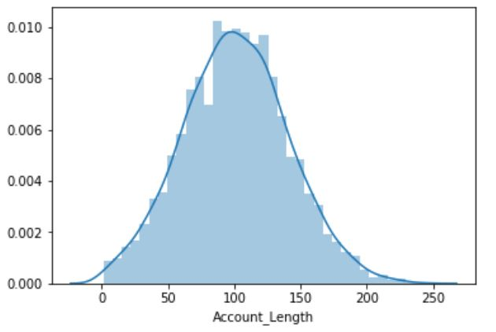
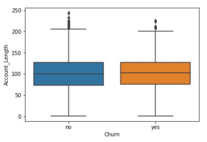
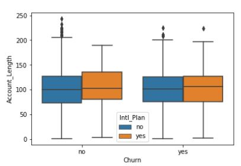

# Predicting-Customer-Churn
Churn is when a customer stops doing business or ends a relationship with a company. It’s a common problem across a variety of industries, from telecommunications to cable TV to SaaS, and a company that can predict churn can take proactive action to retain valuable customers and get ahead of the competition. 

### Exploratory Data Analysis
- Data used here comes from a Cellular usage dataset that consists of records of actual cell phone customers and features.
- Features of interest includes specific features to a customer's cell service, like **`voice mail`** , **`international calling`**, **`cost for the service**`, **`customer usage`**, **`customer churn`**
- Here **churn** is defined as the customer cancelling their cellular plan at a given point in time and is encoded in the dataset as **`no`** and **`yes`**.
- In EDA we understand the features of the dataset, compute summary statistics.

#### Grouping and summarizing data
- Our goal is to classify whether or not a new customer will churn. This model thus has two outcomes, `yes` : customer will churn or `no` : customer will not churn
- We can use EDA to identify differences between these 2 classes. `Do churners call customer service more often?` or `Does one state have more churners compared to another?`. These are some questions we can ask of the data.
- To answers these questions we need to be able to group and summarize our data. To group the data pandas has a method called **`.groupby()`**

### Exploring data using visualizations
- **`Visualizing data in python`** : `seaborn` library allows us to easily create informative & attractive plots, built on top of `matplotlib`

#### Visualizing the distribution of account lengths
- Many ML algorithms make assumptions about **`how the data is distributed`**, so it's **important to understand how the variables in our own dataset are distributed before we apply those algorithms**.
- A **histogram** is an effective way to visualize the distribution of a variable, and we can create one using seaborn's **distplot** function (distribution plot)

```python
import matplotlib.pyplot as plt
import seaborn as sns

sns.displot(telco['Account Length'])
plt.show()
```

<p align="center">
  
</p>

- Here it resembles a bell curve, also known as normal distribution.It turns out that many things we measure in the real-world are well approximated by the normal distribution, and many models actually make the assumption that our data is normally distributed.
- Lets now visualize the differences in account length between churners and non-churners. Effective way to do it using `box plot`, we can do it using seaborn's boxplot function

```python
sns.boxplot(x='Churn',
            y='Account_Length',
            data = telco,
            sym="")
plt.show()
```
<p align="center">
  
</p>

- There doesn't appear to be any noticeful difference in account length. 
- The line in the middle of each box represents the median. The colored boxes represent the middle 50% of the account lengths for each group. The values here range from the 25th to the 75th percentile and gives a sense for the spread of the distribution. The floating points represents outliers, which we can remove using the  **`sym`** parameter

#### Adding a third variable
- Seaborn allows us to easily add a third variable to the plot. For e.g, we might be intersted in visualizing whether the "International Plan" feature has an impact on Account Length or Churn.We can add this info to the plot by specifying the **`hue`** parameter.

<p align="center">
  
</p>

- From the plot,it looks like as far as predicting churn goes it does not matter whether or not a customer had an international plan.


